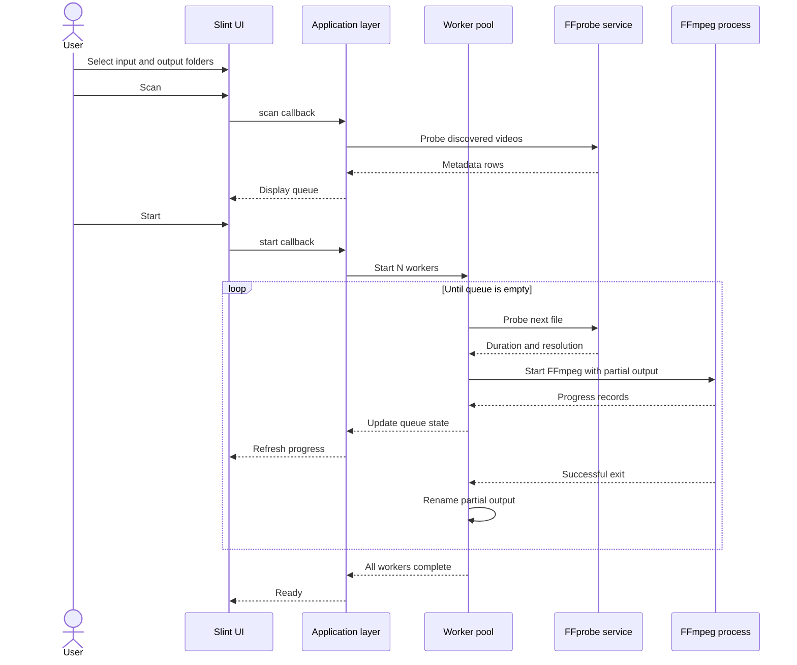

# Processing sequence

## Compression Advisor sequence

1. Read dimensions, duration, and frame rate with FFprobe.
2. Fit the source inside the maximum resolution without upscaling.
3. Convert target size into an audio-plus-video bitrate budget.
4. Compare the video budget with the selected codec's quality floor.
5. Display predicted size and quality before encoding.
6. Encode to a partial output file.
7. Measure the partial file.
8. If it is too large and retries are enabled, reduce bitrate and encode again.
9. Rename the accepted partial file into its final output name.
