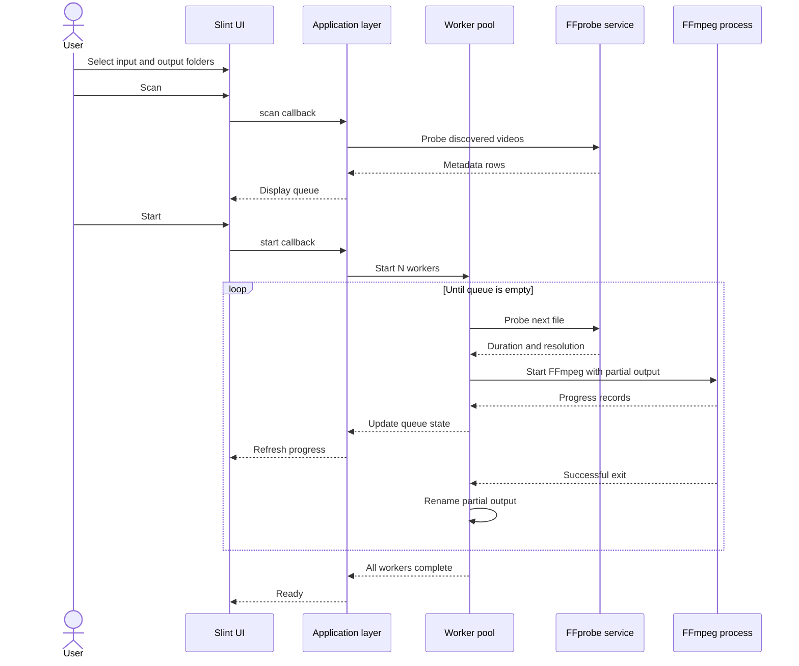

# Processing sequence

```mermaid
sequenceDiagram
    actor User
    participant UI as Slint UI
    participant App as Application layer
    participant Pool as Worker pool
    participant Probe as FFprobe service
    participant Encode as FFmpeg process

    User->>UI: Select input and output folders
    User->>UI: Scan
    UI->>App: scan callback
    App->>Probe: Probe discovered videos
    Probe-->>App: Metadata rows
    App-->>UI: Display queue

    User->>UI: Start
    UI->>App: start callback
    App->>Pool: Start N workers

    loop Until queue is empty
        Pool->>Probe: Probe next file
        Probe-->>Pool: Duration and resolution
        Pool->>Encode: Start FFmpeg with partial output
        Encode-->>Pool: Progress records
        Pool-->>App: Update queue state
        App-->>UI: Refresh progress
        Encode-->>Pool: Successful exit
        Pool->>Pool: Rename partial output
    end

    Pool-->>App: All workers complete
    App-->>UI: Ready
```
